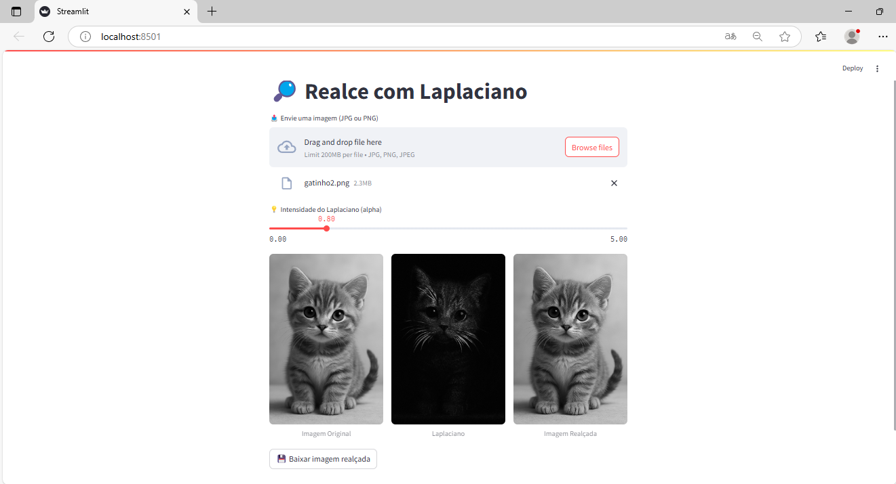

# Laplaciano Sharpen Streamlit

Uma aplicação interativa feita com [Streamlit](https://streamlit.io/) para aplicar **realce com filtro Laplaciano** em imagens (JPG ou PNG). Permite ajustar a intensidade do filtro via slider.



## O que ela faz?

- Faz upload de uma imagem
- Converte para escala de cinza
- Aplica filtro Laplaciano
- Realça os contornos com nitidez ajustável (`alpha`)
- Permite baixar a imagem resultante

## Como executar

1. Clone o repositório:

```bash
git clone https://github.com/SEU_USUARIO/laplaciano-sharpen-streamlit.git
cd laplaciano-sharpen-streamlit


